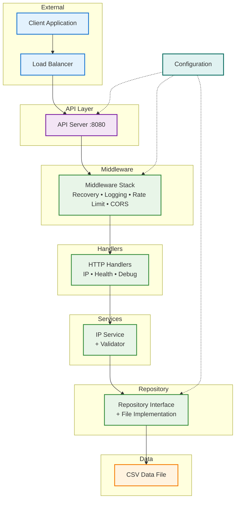
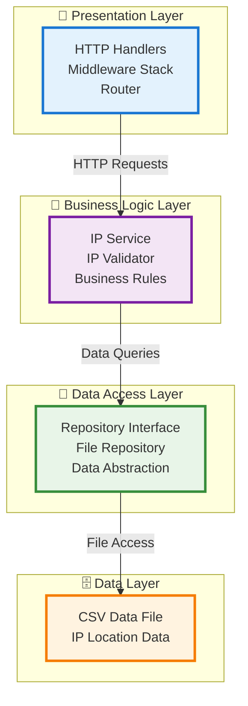
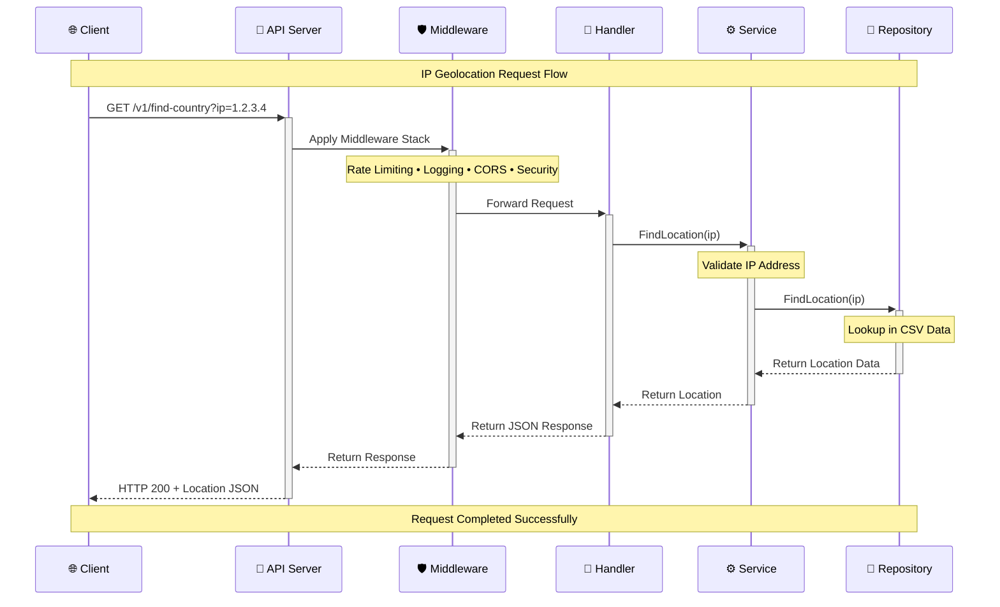

# IP Geolocation Service - Architecture Diagram

## System Architecture

## Layer Architecture

## Request Flow Sequence

## Key Features

| Feature | Description |
|---------|-------------|
| 🏗️ **Clean Architecture** | Clear separation of concerns with layered design |
| 🚦 **Rate Limiting** | Token bucket implementation with configurable limits |
| 🏥 **Health Checks** | Service and repository health monitoring |
| 🛡️ **Middleware Stack** | Recovery, Logging, CORS, Security headers |
| 💾 **Repository Pattern** | Data access abstraction with interface-based design |
| 🔧 **Dependency Injection** | Constructor-based DI for testability |
| 📊 **Structured Logging** | JSON/text logging with configurable levels |
| 🐳 **Docker Support** | Multi-stage build with Docker Compose |
